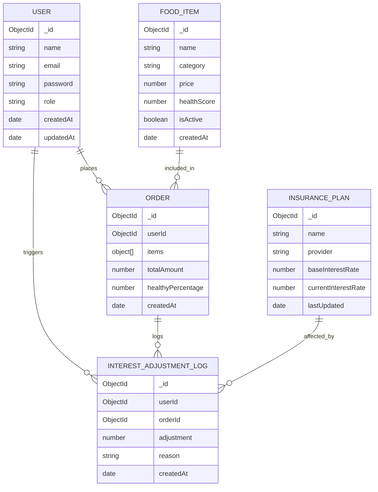

# Core Backend API

Production-ready REST API for Food + Insurance apps.

## Stack
- Node.js 20
- Express + Mongoose
- MongoDB Atlas
- JWT auth with httpOnly cookies
- Swagger (`/api-docs`)

## Setup
```bash
cp .env.example .env
npm install
npm run seed
npm run dev
```

## Environment Variables
- `MONGO_URI`
- `JWT_SECRET`
- `CLIENT_URL` (comma-separated frontend origins)
- `COOKIE_SECURE`

## API Base URL
`/api/v1`

## Key Endpoints
- `POST /auth/register`
- `POST /auth/login`
- `GET /auth/me`
- `GET /food`
- `POST /orders`
- `GET /insurance/plans`
- `GET /insurance/adjustments` (ADMIN)

## Interest Engine Rules
1. `order.totalAmount > 1000` => `+0.5%`
2. `>5 orders in last 30 days` => `+0.25%`
3. `healthyPercentage > 60` => `+0.4%`
4. `healthyPercentage < 30` => `-0.3%`
5. Adjustment capped to `[-1%, +2%]`

Order creation and reversal execute inside Mongo transactions.

## Tests
```bash
npm test
```

## ER Diagram

